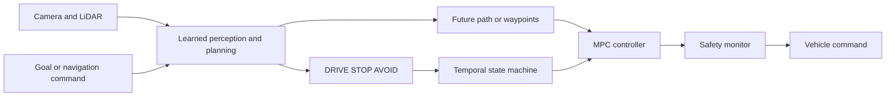
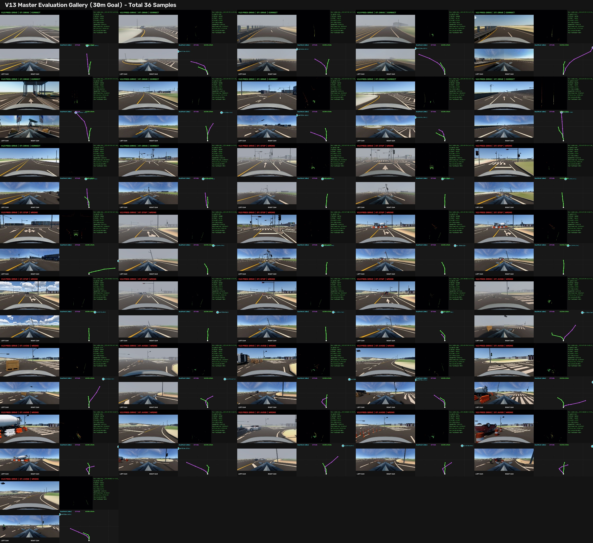
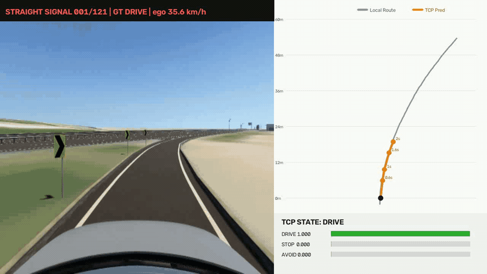
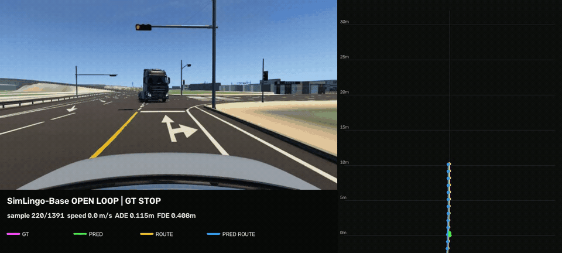
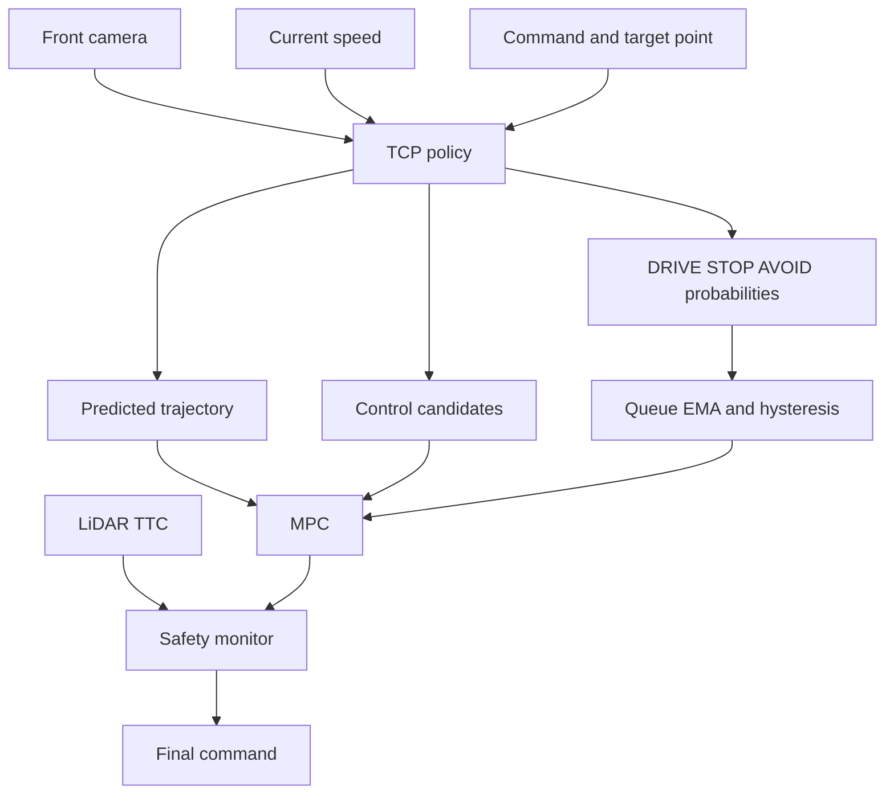

# MORAI Autonomous Driving — Learned Planning Study

MORAI 주행 데이터로 **경로 예측, 상태 판단, 속도·제어 예측**을 실험한 자율주행 연구 프로젝트다. 카메라·LiDAR·지도·ego state를 결합한 자체 planner에서 시작해, 반복 실험으로 확인한 shortcut learning과 시간/공간 label 충돌을 제거하며 V17까지 발전시켰다. 이후 같은 데이터에서 TCP와 SimLingo-Base 계열을 학습해 구조별 성능과 한계를 비교하고 있다.

이 문서의 수치는 별도 언급이 없으면 **bag replay 기반 open-loop 검증 결과**다. Closed-loop 주행 성능을 뜻하지 않으며 실제 투입 전 MPC와 Safety Monitor 검증이 필요하다.

## 1. 프로젝트 개요

현재 시스템은 하나의 신경망에 모든 책임을 맡기지 않는다.

- 학습 모델: 카메라·LiDAR 관측으로 미래 경로와 주행 상태 추정
- State machine: `DRIVE / STOP / AVOID` 확률을 시간적으로 안정화
- MPC: 선택된 경로를 추종하며 종·횡방향 제어
- Safety Monitor: 충돌 임박 상황에서 최종 강제 정지



핵심 평가 상황은 신호등·선행 차량 정지, 정적·동적 장애물, 교차로, 고속 구간, 터널 GPS blackout 및 날씨·운전자 변화다.

## 2. 데이터셋

ROS bag 센서 timestamp를 동기화해 4 Hz sample을 생성한다. GPS blackout은 터널의 실제 localization 조건이므로 삭제하거나 궤적을 인위적으로 보정하지 않는다. 인접 프레임 누출을 막기 위해 train/validation/test는 **bag 단위**로 나눈다.

### 기존 47-bag 데이터

| 항목 | 값 |
| --- | ---: |
| 원본 주행 | 47 bags, 약 3.72시간 |
| 전체 sample | 52,034 |
| DRIVE | 44,630 (85.8%) |
| STOP | 6,350 (12.2%) |
| AVOID | 1,054 (2.0%) |
| GPS blackout | 2,198 |

### 확장 데이터

2026-09-07 기준 원본은 **88 bags, 37.56 GiB**로 확장됐다. 신규 41 bags는 현재 SimLingo 학습 종료 후 증분 변환하고 기존 데이터와 병합한다.

| 용도 | 이미지 저장 형상 | 비고 |
| --- | --- | --- |
| TCP | `900×256` | front-camera compact cache |
| SimLingo-Base adaptation | `672×336` | 336 정사각형 두 patch |


Bench2Drive는 CARLA 주행 prior와 MORAI domain adaptation 가능성을 확인하는 데 사용했다. 카메라 시야각, LiDAR 장착 위치, 지면 분포와 좌표계를 MORAI 형식에 맞췄으며 최종 평가는 MORAI bag split에서 수행한다.



## 3. 현재 비교 모델

### V17 spatial-goal planner

- 입력: 3-camera, LiDAR BEV, 단일 30 m goal
- 입력에서 제거: MGeo, local route, current ego state
- 출력: 3/6/10/15/22/30 m 고정 공간 anchor 경로, speed head, 상태 분류
- 목적: 지도·위치 shortcut과 시간 기반 종방향 label 모순 제거

Local route는 정답 경로와 고정 거리 anchor 생성에만 사용하며 모델 입력에는 넣지 않는다.

### TCP full policy

공개 Roach-distilled TCP checkpoint는 teacher로 고정하지 않고 **초기화 용도**로만 사용한다. MORAI 사람 주행으로 encoder와 trajectory/control branch를 모두 다시 학습한다.

- 입력: single front RGB, current speed, navigation command, target point
- trajectory branch: 미래 waypoint 예측
- control branch: current/future control 예측
- supervision: 실제 미래 pose, current control, future control
- feature distillation과 frozen teacher는 사용하지 않음

47-bag 학습의 best는 Epoch 9다.

| 지표 | TCP best |
| --- | ---: |
| Val ADE | 0.641 m |
| Val FDE at 2 s | 1.122 m |
| Current control MAE | 0.061 |
| Future control MAE | 0.097 |

88-bag 학습은 기존 Epoch 9에서 이어가지 않고 같은 공개 pretrained checkpoint에서 새로 시작한다. 그래야 데이터 증가 효과를 공정하게 비교할 수 있다.



### SimLingo-Base adaptation

공식 full SimLingo VLA의 LoRA 조정과는 다른 실험이다. SimLingo-Base의 작은 driving-only recipe를 MORAI 데이터에 맞췄다.

- pretrained CLIP ViT-L/14-336 전체 fine-tuning
- 입력: front RGB, current speed, 10 m target point
- scratch LLaMA-style decoder: 12 layers, hidden 512, 8 heads
- 약 355M parameters
- 672×336 이미지를 336×336 두 patch로 입력
- 20-point geometric route head
- 10-point, 2-second temporal waypoint head
- 30 epochs, effective batch size 28

2026-09-07 현재 완료 checkpoint 중 best는 Epoch 26이다.

| 지표 | SimLingo-Base Epoch 26 |
| --- | ---: |
| Val ADE | **0.543 m** |
| Val FDE at 2 s | **1.135 m** |
| Train ADE | 0.185 m |
| Train FDE at 2 s | 0.365 m |

평균 ADE는 TCP보다 낮지만 2초 endpoint는 TCP와 비슷하거나 조금 나쁘다. 횡방향 형상은 비교적 안정적이나 정지·재출발을 포함한 종방향 진행량이 주요 병목이다. Train–validation gap도 커서 bag-level unseen 평가가 중요하다.



## 4. 결과 해석

| 모델 | Parameters | Val ADE | FDE at 2 s | 직접 control 출력 |
| --- | ---: | ---: | ---: | --- |
| TCP full policy | 약 25.5M | 0.641 m | **1.122 m** | 지원 |
| SimLingo-Base adaptation | 약 354.9M | **0.543 m** | 1.135 m | 미지원 |

두 ADE는 sampling 정의가 완전히 같지 않다. TCP는 0.6/1.0/1.6/2.0초 네 horizon, SimLingo adaptation은 0.2초 간격 10개 point를 사용한다. 따라서 endpoint, 상태별 지표, 시간 안정성, closed-loop 이탈·충돌·미션 성공률을 함께 봐야 한다.

- TCP는 작고 빠르며 직접 제어 branch가 있어 실시간 배치가 쉽다.
- SimLingo adaptation은 평균 경로 형상이 좋지만 크고 종방향 오차가 남는다.
- AVOID가 희소하므로 같은 장애물·위치 암기 여부를 별도로 검증해야 한다.
- frame accuracy가 높아도 순간 오인식이 제어로 전달되지 않도록 queue/EMA/hysteresis가 필요하다.

## 5. 런타임 연결



상태 분류는 모델 내부 hard routing에 사용하지 않는다. 경로·속도·상태 후보는 계속 출력하고 후단 state machine이 적용 여부를 결정한다. 급정지는 학습 모델과 별개로 LiDAR TTC Safety Monitor가 담당한다.

## 6. 재현 및 모니터링

대용량 bag, cache, checkpoint는 저장소에 포함하지 않는다.

```bash
# SimLingo-Base adaptation
python -m simlingo_base_morai.train \
  --data-root morai_dataset/processed/simlingo_base_teacher_local_v1 \
  --split-manifest morai_dataset/processed/simlingo_base_teacher_local_v1/split.json \
  --output-dir training_outputs/simlingo_base_teacher_v1 \
  --epochs 30 --batch-size 4 --grad-accum 7 --workers 4 --lr 3e-5

# TCP full-policy fine-tuning
python -m tcp_morai_finetune.train_full_policy \
  --data-root morai_dataset/processed/tcp_teacher_local_v2 \
  --split-manifest morai_dataset/processed/tcp_teacher_local_v2/split.json \
  --control-cache morai_dataset/processed/tcp_teacher_controls_local_v1 \
  --init-checkpoint external_models/tcp_reproduction/tcp_state_dict_only.pt \
  --output-dir training_outputs/tcp_teacher_full_policy_v3_88bags \
  --epochs 10 --batch-size 16 --num-workers 6
```

## 7. Fallback과 V1–V17 개발 과정

| 버전 | 시도 | 관찰된 문제와 다음 판단 |
| --- | --- | --- |
| V1–V2 | 3-camera, VLP16 BEV, ego/localization, MGeo, local route로 20점 trajectory 예측 | 지도·route·위치가 시각·LiDAR보다 쉬운 shortcut이 됐다. |
| V3 | ego-relative `x, y, yaw, future_speed`, K=3 mode와 outlier gallery | mode 평균과 선택이 불안정했고 GPS jump를 데이터 보정으로 숨기지 않기로 했다. |
| V4 | K=1, position/step/second-difference/yaw/heading loss | GT 미분 구조를 따르게 했지만 non-finite가 발생해 FP32 retry와 sample 추적을 추가했다. |
| V5 | 시작점과 controller 연결을 `(0,0)` 기준으로 정리 | 시간 기반 20점 trajectory와 실제 속도 결합 문제가 남았다. |
| V6 | DRIVE와 STOP 명시적 분리 | frame 분류를 내부 hard routing에 연결하면 상태가 흔들렸다. |
| V7 | local route 기반 Frenet residual `delta d` | 회피량만 학습할 수 있었지만 같은 장애물·위치를 외우기 쉬웠다. |
| V8 | residual 경로를 MPC에 연결 | 일반·고속 주행은 가능했으나 불필요한 residual이 MPC를 횡방향으로 끌었다. |
| V9 | DRIVE/STOP/AVOID classifier와 `delta d`, `delta v` 후보 분리 | 후단 state machine 적용 원칙을 세웠지만 route/ego shortcut이 남았다. |
| V10 | 4초 6점 candidate와 입력 축소 | current speed 없이 시간 후 종방향 위치를 요구하는 모순이 드러났다. |
| V11 | Beta NLL/KL과 TCP distillation 검토 | TCP가 완벽한 MORAI teacher가 아니어서 frozen-teacher 모방을 채택하지 않았다. |
| V12–V13 | Bench2Drive 사전학습과 MORAI adaptation | 신호등, 센서 장착 위치, 지면 분포의 domain gap이 컸다. |
| V14 | local route 대신 single goal로 경로 생성 | route shortcut은 줄었지만 backbone unfreeze 뒤 과적합이 나타났다. |
| V15–V16 | 30 m goal, 6-point candidate, head 분리 | 시간 축 출력이 속도와 공간 경로 형상을 계속 얽었다. |
| V17 | 3-camera + LiDAR + 30 m goal, 고정 공간 anchor | MGeo/local route/current ego를 제거하고 경로·속도·상태 책임을 분리했다. |

### 현재 fallback

1. pretrained TCP를 MORAI 88-bag 데이터로 full fine-tuning한다.
2. TCP trajectory/control을 기본 주행 후보로 사용한다.
3. 상태 확률은 시간 필터를 거쳐 적용한다.
4. MPC가 경로 추종과 속도 제어를 담당한다.
5. LiDAR TTC Safety Monitor가 최종 충돌 방지를 담당한다.

순수 단일-network E2E보다 모듈이 많지만 각 실패 원인을 측정하고 대회 환경에서 안전하게 fallback할 수 있다.

## 8. 초기 ROS2 baseline

`src/vla_driving`, `scripts/infer.py`, `scripts/extract_ros2_bag.py`는 프로젝트 초기 camera + 2D LiDAR + pose 경량 ROS2 baseline이다. 현재 MORAI TCP/SimLingo 실험과 센서 계약이 다르며, 초기 데이터 추출과 controller smoke test 재현을 위해 보존한다.
