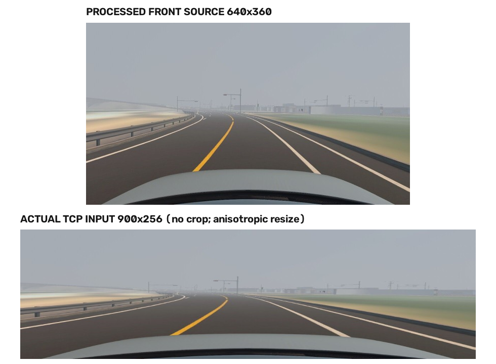
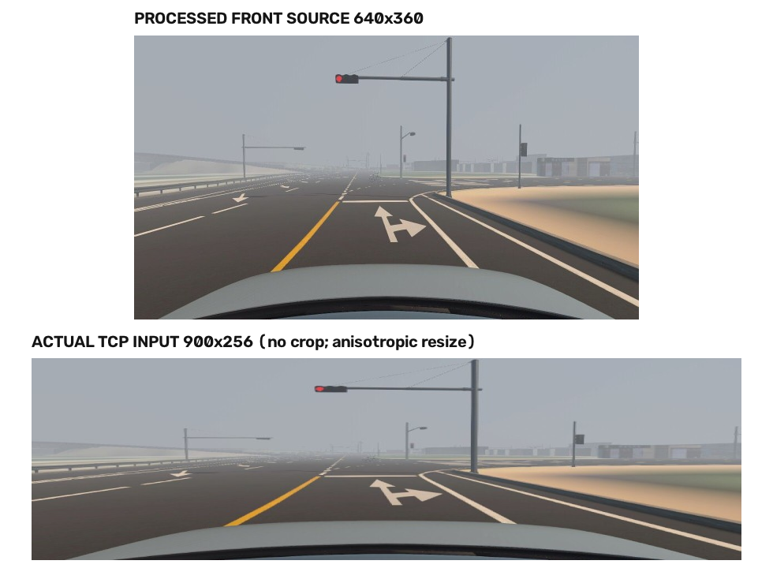
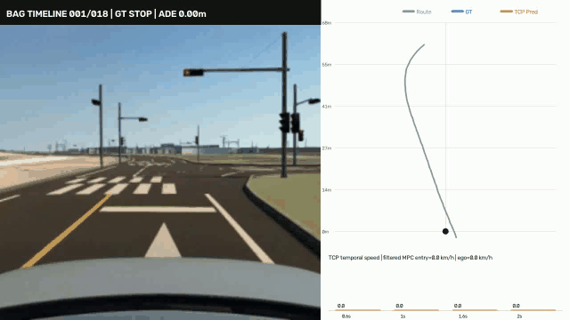
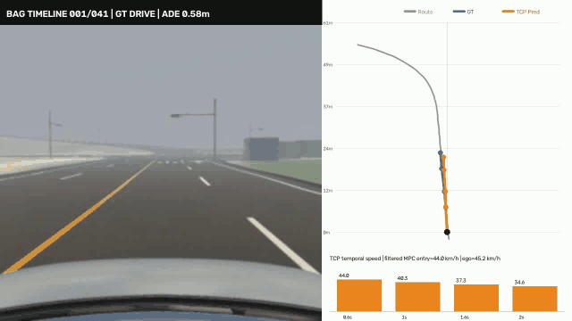
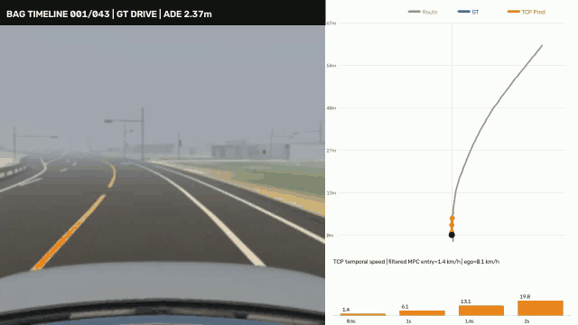
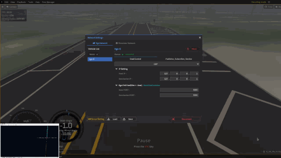
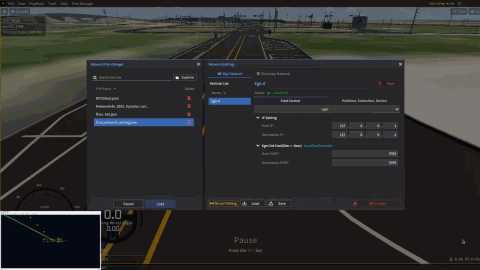

# VLA Driving

이 저장소는 3대 카메라와 VLP16 BEV, 단일 목표점으로 30 m 공간 경로와
상태를 예측하고 MPC에 전달하는 MORAI V17 멀티모달 플래너를 기록한다.

raw bag, 변환 NPZ, 학습 출력, checkpoint는 용량 및 데이터 관리 문제로 Git에 포함하지 않습니다. 재현용 소스와 변환·학습 정책은 포함합니다.

## 1. 프로젝트 개요

MORAI 환경에서 주어진 목표 방향으로 경로를 만들고, 정지·회피 상황을 분류한 뒤 MPC가 추종할 참조 경로와 속도 후보를 제공하는 것이 목표다. 모델은 제어 명령을 직접 확정하지 않으며, 상태 선택·경로 보간·안전 제한은 runtime 계층에서 수행한다.

### 문서 구성

1. 프로젝트 개요
2. 최종 시스템 설계
3. 데이터셋과 변환
4. 학습 및 정량 평가
5. 정성 평가와 closed-loop 주행
6. Runtime·MPC·안전 설계
7. 재현 방법
8. V1→V17 개발 과정
9. Fallback과 안전 경계

## 2. 최종 시스템 설계: MORAI V17

`src/multimodal_planner_v17_spatial30/`는 MORAI용 최종 실험 계보입니다. 입력은 최근 1초의 센서 history와 **30 m goal point**뿐입니다.

```text
Front camera  [B, 5, 3, 360, 640] ─┐
Left camera   [B, 5, 3, 240, 320] ─┼─ Shared pretrained ResNet18 + camera-ID
Right camera  [B, 5, 3, 240, 320] ─┘
VLP16 BEV     [B, 5, 3, 256, 256] ─── Light BEV CNN
                                         ↓
                            8 sensor-conditioned spatial tokens
                                         ↓
                           shared temporal GRU (history=5)
                                         ↓
                     Goal-point cross-attention / fused context
                                         ↓
          ┌──────── DRIVE path: 6 × (x,y) at fixed stations ────────┐
          ├──────── AVOID path: 6 × (x,y) at fixed stations ────────┤
          ├──────── absolute speed: 6 stations (Beta mean) ─────────┤
          └──────── action logits: DRIVE / STOP / AVOID ────────────┘
```


공간 station은 **3, 6, 10, 15, 22, 30 m**이다. 경로는 시간 후 차량 위치가 아니라, ego 기준 route-progress 상의 기하 형상이다. 따라서 planner가 경로 형상을 만들고, 외부 state machine이 상태별 후보를 선택한 뒤 smoothing·0.1 m resampling을 수행해 MPC에 전달한다. STOP은 경로 회귀 대상이 아니라 분류 결과를 통해 목표 속도 0으로 강제한다.

### 모델 계약

| 항목 | V17 계약 |
| --- | --- |
| 입력 | Front/Left/Right 5-frame history, 3-channel VLP16 BEV history, ego-relative 30 m goal point |
| 경로 출력 | DRIVE 6×2, AVOID 6×2; 모두 3/6/10/15/22/30 m 고정 공간 station |
| 종방향 출력 | 같은 station에서의 absolute speed 6개 |
| 상태 출력 | DRIVE / STOP / AVOID probability |
| 모델에서 제외 | current speed, ego/IMU/GPS, MGeo, local route |
| route의 역할 | offline label 및 30 m goal 생성용. 모델 입력은 아님 |

## 3. 데이터셋과 변환

- **MORAI**: 실제 deployment target. DRIVE/STOP/AVOID를 bag 구간 단위로 수동 검수해 label manifest를 만든다.
- **Bench2Drive**: 멀티센서 표현 학습을 위한 사전학습 데이터. MORAI VLP16의 전방 장착 특성과 가까워지도록 camera·LiDAR representation을 변환한다.
- **GPS blackout**: 터널 구간은 삭제하지 않는다. GPS health를 학습 shortcut으로 사용하지 않으며, blackout/non-blackout을 분리해 진단한다.
- **증강**: geometry는 바꾸지 않고 color jitter, 밝기·대비, fog를 적용한다. 신호등 색 의미를 뒤집는 hue 증강은 제한한다.


## 4. 학습 및 정량 평가

2026-08-20 기준 MORAI validation 결과(고정 3/6/10/15/22/30 m 축)는 아래와 같다. 이는 open-loop 검증이며, 최종 판단은 bag replay와 MPC 폐루프 시험으로 한다.

| 항목 | 결과 |
| --- | ---: |
| 전체 path coordinate MAE | 0.333 m |
| DRIVE ADE / lateral MAE | 0.590 m / 0.568 m |
| AVOID ADE / lateral MAE | 0.535 m / 0.495 m |
| speed MAE | 1.715 m/s (약 6.2 km/h) |
| action accuracy / macro-F1 | 98.23% / 94.77% |
| AVOID precision / recall | 78.63% / 98.92% |

AVOID recall은 높지만 DRIVE를 AVOID로 판정하는 보수적 오탐이 아직 존재한다. 따라서 실제 runtime에서는 raw argmax를 즉시 적용하지 않고 state queue, confidence threshold, TTC 기반 safety monitor를 함께 사용해야 한다. 이 수치는 차선 이탈·충돌이 없다는 보증이 아니다.

### 4.1 V17 정량 결과 해석

이 수치는 2026-08-18 fine-tuning best checkpoint의 open-loop validation
결과다. 제한된 검증 split에서 경로·속도·상태를 측정한 값이므로, 실제 제어
안정성은 5장의 closed-loop 결과와 함께 판단한다.

### 4.2 TCP state-only 비교 모델

TCP trajectory 성능을 유지하면서 상황 판단만 개선하기 위해, TCP MORAI V2의
trajectory 기준 최적 checkpoint를 고정하고 카메라 feature에 연결된
`DRIVE / STOP / AVOID` classification head만 추가 학습했다. TCP encoder,
measurement branch, trajectory decoder와 BatchNorm running statistics는 모두
고정했다. 따라서 V3의 trajectory 수치는 초기 TCP checkpoint와 같고, 변경된
부분은 state classifier뿐이다.

#### Validation 결과

| 항목 | 결과 |
| --- | ---: |
| State accuracy | 97.72% |
| State macro-F1 | 95.95% |
| 전체 ADE / FDE@2s | 0.674 m / 1.152 m |
| DRIVE ADE | 0.943 m |
| STOP ADE | 0.122 m |
| AVOID ADE | 0.854 m |

검증 confusion matrix는 actual row, predicted column이며 class 순서는
`DRIVE / STOP / AVOID`이다.

```text
3480   32   10
  76 1668    0
   4    0   89
```

#### Temporal stability 진단

검증 5,359 sample을 확인했을 때, 단일 출력의 네 waypoint가
좌→우→좌로 꺾이는 내부 지그재그는 0건이었다. 반면 가까운 연속 sample
5,144쌍 중 GT lateral 변화가 0.5 m 미만인데 예측만 1 m 이상 바뀐 경우가
35쌍(0.68%) 있었고, GT보다 예측 변화가 1 m 이상 과도한 경우는
23쌍(0.45%)이었다. 즉 문제는 한 경로 내부 형상보다 single-frame TCP 출력의
프레임 간 불연속에 가깝다.

### 4.3 TCP full-policy MORAI 재학습

TCP state-only 실험은 pretrained trajectory를 보존한 채 classifier만 학습했기
때문에 MORAI 사람 주행의 직접 제어를 배우지 않았다. 다음 단계에서는 공개 TCP
재현 checkpoint에 들어 있는 Roach-distilled driving prior를 **초기화로만** 사용하고,
frozen teacher, feature/value distillation, teacher action KL을 모두 제거했다. ResNet34
encoder부터 trajectory-guided direct-control branch까지 풀어 MORAI 사람 주행 label로
policy 전체를 다시 학습했다.

```text
TCP checkpoint (initialization only)
                 │
Front RGB 3×256×900 + speed + target point + command
                 │
      fully trainable ResNet34 encoder
                 ├─ trajectory branch → 4 waypoints (0.6/1.0/1.6/2.0 s)
                 ├─ current Beta control → signed acceleration, steering
                 ├─ trajectory-guided recurrent control → 4 future controls
                 └─ auxiliary current-speed prediction
```

별도 `/Ctrl_cmd`가 없는 bag은 `/morai/ego_vehicle_status`의 실제 적용
`accel`, `brake`, `steer`를 ROS timestamp로 camera frame에 정렬했다. signed acceleration은
우세한 brake를 음수로, throttle을 양수로 표현하며 steering은 MORAI의 ±40°를
`[-1,1]`로 정규화했다. 원본 bag이 남아 있는 188/229개 source를 사용할 수 있었고,
effective split은 train 28,223 / validation 2,613 sample이다. source run 기준
train/validation/test 중복은 없다.

#### 최종 validation 결과

| 항목 | Epoch 2 | Epoch 10 best |
| --- | ---: | ---: |
| 전체 ADE / FDE@2s | 0.437 / 0.750 m | **0.391 / 0.664 m** |
| state macro ADE | 0.577 m | **0.521 m** |
| DRIVE ADE / FDE@2s | 0.848 / 1.454 m | **0.769 / 1.302 m** |
| STOP ADE / FDE@2s | 0.059 / 0.105 m | **0.044 / 0.079 m** |
| AVOID ADE / FDE@2s | 0.823 / 1.380 m | **0.751 / 1.240 m** |
| DRIVE current steer MAE | 0.285 | **0.247** |
| AVOID current steer MAE | 0.364 | **0.321** |

전체 ADE만 보면 STOP이 validation의 52%를 차지해 성능이 과도하게 좋아 보인다.
따라서 checkpoint 비교에는 state macro ADE와 DRIVE/AVOID 분리 지표를 사용했다.
AVOID steering MAE 0.321은 약 12.8°이므로 open-loop 경로 지표가 좋아도 direct
control 회피를 바로 안전하다고 판단할 수 없다. epoch별 원본 결과는
[`results/tcp_morai_full_policy_v1/`](results/tcp_morai_full_policy_v1/)에 보관한다.

#### 실제 입력 전처리 확인

원본 TCP control attention은 ResNet feature map을 8×29로 고정해 256×900 입력을
요구한다. MORAI 640×360 front frame은 crop 없이 900×256으로 강제 resize되므로
내용은 사라지지 않지만 가로로 늘고 세로로 눌린다. 이는 현재 실험의 명시적인
domain/preprocessing 한계이며 향후 aspect-preserving adapter 또는 attention
shape 변경으로 비교해야 한다.

| 일반 DRIVE 입력 | 빨간불 STOP 입력 |
| --- | --- |
|  |  |

#### Open-loop bag replay

- [한 바퀴 DRIVE 추론 영상](assets/tcp_full_policy_v1/videos/epoch_010_best_one_lap.mp4)
- [DRIVE / STOP / AVOID 포함 추론 영상](assets/tcp_full_policy_v1/videos/epoch_010_drive_stop_avoid_full_camera.mp4)

두 영상은 recorded bag을 재생한 **open-loop** 결과다. 아래 5.3절의 두
closed-loop 주행과 구분하며, 영상의 검은 제목 바는 카메라 아래로 배치해 상단
신호등을 가리지 않도록 수정했다.

## 5. 정성 평가와 closed-loop 주행

정량 지표만으로는 경로 형상, 상태 전환 시점, MPC가 실제로 경로를 추종할 수
있는지를 판단할 수 없다. 따라서 기록된 bag을 이용한 open-loop 추론과 모델
출력을 차량 제어에 되먹임한 closed-loop 주행을 분리해 평가했다.

### 5.1 V17 open-loop bag replay

아래 결과는 카메라 3대, LiDAR BEV, DRIVE/AVOID candidate, action probability,
station별 speed를 함께 표시한 open-loop 추론이다. state queue, MPC와 차량
동역학은 평가에 포함되지 않는다.

| DRIVE | STOP | AVOID |
| --- | --- | --- |
|  |  |  |

### 5.2 TCP/MPC baseline open-loop bag replay

아래 영상은 V17 결과가 아니라 비교용 TCP/MPC baseline의 open-loop 결과다.

| 파란불 직진 | 일반 신호등 | 정적 장애물 속도 preview |
| --- | --- | --- |
|  |  |  |

### 5.3 State-based closed-loop 주행

다음 두 영상만 모델 출력이 실제 주행 경로와 상태 선택에 반영된 closed-loop
결과다. 위의 open-loop bag replay와 구분한다.

#### TCP state-only DRIVE / STOP



[원본 MKV 다운로드](assets/morai_v17/videos/TCP_state%20only_drive%2Cstop.mkv)

#### V17 state-based



[원본 MKV 다운로드](assets/morai_v17/videos/v17_State_based.mkv)

두 closed-loop 영상은 상태 판단과 경로 출력을 실제 제어 계층에 연결할 수 있음을
보여준다. 다만 제한된 MORAI 코스의 실험 결과이며, 처음 보는 장애물과 더 다양한
교차로에 대한 일반화를 보증하지는 않는다.

## 6. Runtime·MPC·안전 설계

### 6.1 State-based smoothing

trajectory는 매 시점의 ego-relative 좌표이므로 이전 출력과 현재 출력을
그대로 평균 내면 안 된다. 이전 경로를 pose 변화만큼 현재 ego frame으로
변환한 뒤 state별 EMA를 적용한다.

아래 내용은 closed-loop 주행을 안정화하기 위한 state 기반 runtime 처리 원칙이다.

| 상태 | 처리 |
| --- | --- |
| DRIVE | 새 예측 가중치 `alpha=0.20~0.30`으로 안정화 |
| AVOID 진입 | `alpha=0.65~0.80`으로 빠르게 반응 |
| AVOID 유지 | `alpha=0.35~0.50`으로 경로 진동 억제 |
| STOP 진입 | 경로 EMA 대신 즉시 목표 속도 0, 마지막 안정 경로 유지 |
| STOP 해제 | `alpha=0.15~0.25`로 서서히 DRIVE 복귀 |
| 긴급 정지 | EMA와 state queue를 우회하고 Safety Monitor가 즉시 정지 |

state probability에도 EMA와 비대칭 hysteresis를 둔다. STOP은 1~2 frame,
AVOID는 2~3 frame 연속 확인 후 진입하고, DRIVE 복귀는 5~10 frame 연속
확인한다.

### 6.2 ROS/MPC 처리 순서

1. V17은 두 path candidate, speed candidate, action probability를 동시에 출력한다.
2. state queue와 confidence threshold가 action을 안정화한다. 모델 내부 argmax가 곧바로 제어 명령이 되지 않는다.
3. DRIVE는 기본 참조 경로를, AVOID는 회피 candidate를, STOP은 speed=0을 선택한다.
4. 이전 path를 현재 ego frame으로 변환한 뒤 state-dependent smoothing을 적용한다.
5. 선택된 path는 origin 삽입, 0.1 m resampling 후 MPC reference로 전달한다.
6. TTC·충돌 임박 조건은 모델 선택보다 우선하는 external safety monitor가 처리한다.

## 7. 재현 방법

```bash
pip install -e .

# unit-level fixed-station contract
PYTHONPATH=src python -m unittest multimodal_planner_v17_spatial30.test_v17

# dataset manifest와 checkpoint 경로를 준비한 뒤
PYTHONPATH=src python -m multimodal_planner_v17_spatial30.train --help

# TCP full-policy control cache and training
pip install -e '.[morai]'
PYTHONPATH=src python scripts/build_tcp_morai_control_cache.py --help
PYTHONPATH=src python -m tcp_morai_finetune.train_full_policy --help
PYTHONPATH=src python -m tcp_morai_finetune.evaluate_full_policy_by_state --help
```

V17은 `multimodal_planner_v9`, `v10`, `v13_goal_trajectory`, `v16_30m_candidates`의 공통 encoder·loss·metric 계보를 사용한다. 이 때문에 해당 소스도 `src/`에 함께 포함했다. raw MORAI/Bench2Drive 데이터 변환 결과와 pretrained weights는 별도 저장소 또는 로컬 SSD에서 관리한다.


## 8. 개발 과정: V1 → V17과 변경 이유

이 절은 현재 V17 구조가 만들어진 순서를 기록한다. 각 버전에서 잘되지
않았던 지점을 다음 버전의 설계 변경으로 연결한다.

### V1

멀티카메라, LiDAR, ego, MGeo, local route를 모두 넣어 미래 trajectory를 직접
회귀하는 초기 설계였다. 센서와 지도 정보를 한 모델에 넣는 것 자체는
가능했지만, 어떤 입력이 실제 상황 판단에 쓰였는지 분리하기 어려웠다.

### V2

3-view camera, VLP16 BEV, ego, MGeo, local route와 5-frame temporal GRU,
K=3 mode trajectory를 구현했다. bag/run 단위 split, GPS blackout 유지·가중치,
epoch별 outlier gallery를 도입해 데이터 파이프라인을 검증했다. 다만 K=3
candidate의 선택과 평균화가 제어 경로의 안정성을 보장하지는 못했다.

### V3

label을 ego-relative `relative_x, relative_y, relative_yaw, future_speed`로
명확히 하고, 1/2/4초 ADE/FDE, lateral/longitudinal/yaw MAE,
blackout 분리 지표를 추가했다. 문제를 측정할 수 있게 됐지만, 여전히
20점·4초 시간 축 trajectory와 mode 선택을 함께 학습했다.

### V4

mode를 없애 K=1 trajectory로 단순화하고, 위치뿐 아니라 step, 2차 차분,
yaw-heading consistency를 GT와 맞추는 loss를 넣었다. 예측 궤적을 무조건
직선으로 펴는 대신 GT의 미분 구조를 따르게 한 변경이다. 학습 중 non-finite
출력이 발생해 FP32 재시도와 tensor 검사를 추가했다.

### V5

V4에서 첫 future point가 원점 뒤로 가거나 경로가 출발 직후 꺾이던 문제를
고쳤다. controller용 trajectory에 현재 원점 `(0,0)`을 명시적으로 붙이고
first-point/start loss를 추가했다. 시작 경계는 개선됐지만 자유로운 4초
trajectory 회귀는 MPC reference로 쓰기에는 계속 불안정했다.

### V6

정지 장면을 trajectory 하나로 설명하지 않고 STOP/DRIVE head를 추가했다.
정지 label은 미래 속도와 local distance로 정의하고, class-weighted loss와
confusion matrix를 도입했다. 하지만 상태를 모델 내부 trajectory에 직접
condition하면 frame마다 상태가 바뀔 때 제어가 흔들릴 수 있었다.

### V7

경로 전체를 새로 생성하지 않고 Local Route를 기하 prior로 두며,
camera·LiDAR·history가 path-normal residual `Δd`와 speed delta를 예측하도록
바꿨다. 일반 주행에서는 안정적이었지만, route와 MGeo의 정보가 강해지면서
센서가 장애물 장면을 충분히 보지 않아도 되는 shortcut이 생겼다.

### V8

MPC가 속도 계획을 수행한다는 전제에서 learned speed imitation을 제거하고,
fixed-distance `Δd`와 STOP/DRIVE만 남겼다. 장거리 global route에도 residual을
더할 수 있었지만, 일반 경로 오차까지 `Δd`가 보정하려 해 불필요한 횡방향
움직임이 생길 수 있었다.

### V9

route tracking과 mission correction을 분리했다. DRIVE는 기본 route, STOP은
속도 0, AVOID만 `Δd`와 `Δv`를 적용하도록 DRIVE/STOP/AVOID 3-action
계약을 만들었다. raw action·residual은 모두 출력하고 적용 여부는 runtime
state machine이 결정하게 했다. 이 단계에서 action label의 위치 편향과 AVOID
데이터 부족이 드러났다.

### V10

action classifier에서 ego/localization 16차원을 제거하고 camera·LiDAR·route
중심으로 바꿨다. `Δd, Δv`를 6개 waypoint로 줄였으며, STOP은 계속
classification-only로 유지했다. route residual 구조 자체는 남아 있어,
route를 주지 않는 일반화에는 한계가 있었다.

### V11

candidate path와 speed distribution을 분리해 불확실성을 다루는 실험을 했다.
speed에는 Beta 분포 기반 objective를 사용했고, trajectory와 분류가 서로
loss scale을 침범하지 않도록 분리했다. 그러나 route residual과 시간 축
trajectory의 근본 문제는 남아 있었다.

### V12

Bench2Drive representation pretraining과 MORAI adaptation을 검토·준비했다.
목적은 작은 MORAI 데이터만으로 camera·LiDAR encoder를 처음부터 학습하지
않는 것이었다. 이 단계는 deployment 구조 변경보다 도메인 전이와 데이터
변환 검증에 집중했다.

### V13

local route 전체 대신 단일 goal을 조건으로 trajectory를 생성하는
goal-trajectory 계열을 도입했다. 이는 route 복사 shortcut을 줄이기 위한
전환이었다. 다만 시간 기반 위치 target을 유지하면 current speed를 입력에서
제거한 경우 종방향 label이 하나로 정해지지 않는 문제가 남았다.

### V14

Bench2Drive 초기화 후 MORAI fine-tuning을 본격적으로 수행했다. 초기 epoch의
검증 성능은 개선됐지만 backbone unfreeze 뒤 training error만 낮아지고
validation error가 악화되는 과적합을 확인했다. 따라서 best validation
checkpoint 선택과 stronger augmentation/데이터 다양화가 필요해졌다.

### V15

V14의 과적합과 시간 축 target 문제를 분리해 점검한 조정 단계다. camera
도메인 적응만으로 경로 contract의 모순을 해결할 수 없다는 결론을 얻었고,
다음 버전에서 sparse goal/candidate 형식으로 바꾸는 근거가 됐다.

### V16

33.33 m 단일 goal과 TCP-style 6-point DRIVE/AVOID candidate, absolute speed,
3-action head를 만들었다. current speed, ego/GPS, MGeo, local route를 모델
입력에서 제외하고, runtime이 candidate를 선택하도록 했다. 하지만 path의
의미가 여전히 시간 축과 결합돼 있어 속도가 달라질 때 동일한 geometry를
요구하는 문제가 완전히 사라지지 않았다.

### V17

V16의 입력 절제와 candidate 분리를 유지하되, path target을
**3/6/10/15/22/30 m 고정 공간 station**으로 완전히 바꿨다. 따라서
current speed가 없어도 path geometry label은 모순되지 않는다. local route는
오직 offline label/goal 생성에만 사용하며, STOP은 path loss에 넣지 않는다.
현재 검증 지표는 본문 표와 같고, 남은 과제는 폐루프 MPC 평가와 처음 보는
장애물에 대한 AVOID 일반화다.

## 9. Fallback과 안전 경계

V17 또는 TCP state 모델의 출력을 조향·가감속 명령으로 직접 신뢰하지
않는다. planner 출력이 non-finite이거나, action confidence가 낮거나,
state queue가 아직 안정화되지 않았거나, TTC safety monitor가 위험을
감지하면 학습 candidate를 적용하지 않는다.

이 경우 runtime은 기본 global/local centerline과 보수적 속도 제한을 MPC에
전달한다. STOP 또는 충돌 임박이면 목표 속도를 0으로 강제한다. 즉 학습
모델은 기본 경로의 보정·상황 판단 후보를 제공하고, 차선 유지·급정지·충돌
회피의 최종 책임은 MPC와 safety monitor에 남긴다.
