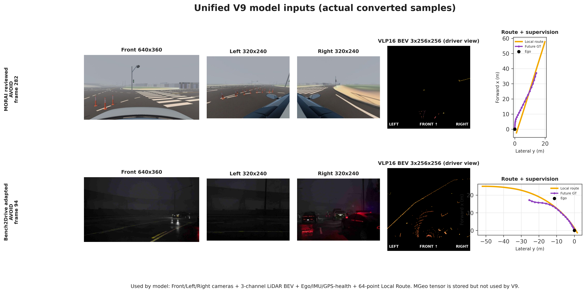
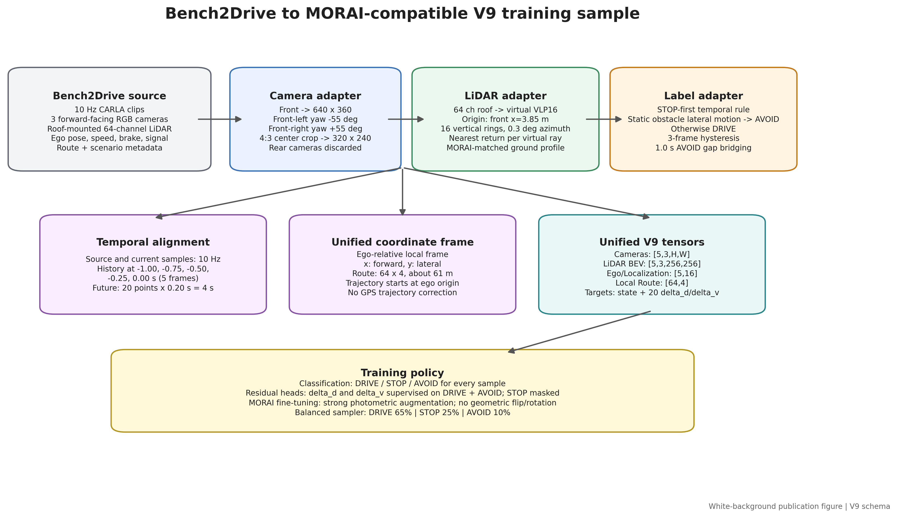
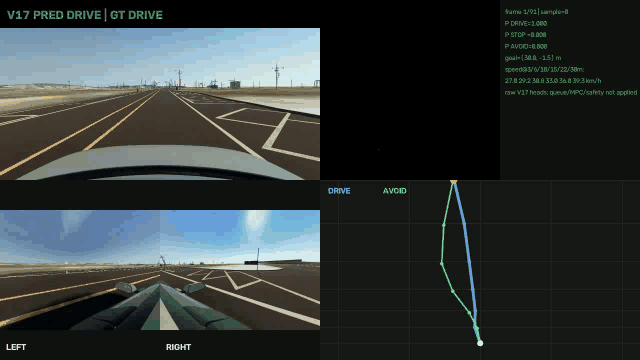
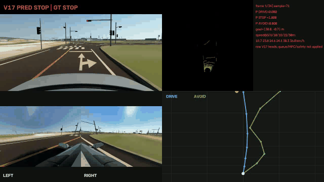
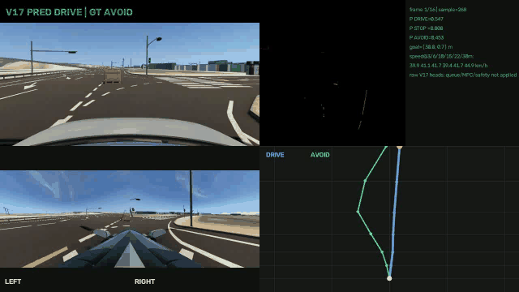

# VLA Driving

이 저장소는 3대 카메라와 VLP16 BEV, 단일 목표점으로 30 m 공간 경로와
상태를 예측하고 MPC에 전달하는 MORAI V17 멀티모달 플래너를 기록한다.

raw bag, 변환 NPZ, 학습 출력, checkpoint는 용량 및 데이터 관리 문제로 Git에 포함하지 않습니다. 재현용 소스와 변환·학습 정책은 포함합니다.

## 1. 프로젝트 개요

MORAI 환경에서 주어진 목표 방향으로 경로를 만들고, 정지·회피 상황을 분류한 뒤 MPC가 추종할 참조 경로와 속도 후보를 제공하는 것이 목표다. 모델은 제어 명령을 직접 확정하지 않으며, 상태 선택·경로 보간·안전 제한은 runtime 계층에서 수행한다.

### Demo

V17 영상은 GitHub README에서 바로 보이도록 GIF로 삽입했다.
[V17 bag replay](#v17-bag-replay)에서 DRIVE·STOP·AVOID 결과를 바로
재생할 수 있다. MP4 원본은 각 GIF 아래의 다운로드 링크로만 제공한다.

## 2. 최종 시스템: MORAI V17

`src/multimodal_planner_v17_spatial30/`는 MORAI용 최종 실험 계보입니다. 입력은 최근 1초의 센서 history와 **30 m goal point**뿐입니다.

```text
Front camera  [B, 5, 3, 360, 640] ─┐
Left camera   [B, 5, 3, 240, 320] ─┼─ Shared pretrained ResNet18 + camera-ID
Right camera  [B, 5, 3, 240, 320] ─┘
VLP16 BEV     [B, 5, 3, 256, 256] ─── Light BEV CNN
                                         ↓
                            8 sensor-conditioned spatial tokens
                                         ↓
                           shared temporal GRU (history=5)
                                         ↓
                     Goal-point cross-attention / fused context
                                         ↓
          ┌──────── DRIVE path: 6 × (x,y) at fixed stations ────────┐
          ├──────── AVOID path: 6 × (x,y) at fixed stations ────────┤
          ├──────── absolute speed: 6 stations (Beta mean) ─────────┤
          └──────── action logits: DRIVE / STOP / AVOID ────────────┘
```



공간 station은 **3, 6, 10, 15, 22, 30 m**이다. 경로는 시간 후 차량 위치가 아니라, ego 기준 route-progress 상의 기하 형상이다. 따라서 planner가 경로 형상을 만들고, 외부 state machine이 상태별 후보를 선택한 뒤 smoothing·0.1 m resampling을 수행해 MPC에 전달한다. STOP은 경로 회귀 대상이 아니라 분류 결과를 통해 목표 속도 0으로 강제한다.

### 모델 계약

| 항목 | V17 계약 |
| --- | --- |
| 입력 | Front/Left/Right 5-frame history, 3-channel VLP16 BEV history, ego-relative 30 m goal point |
| 경로 출력 | DRIVE 6×2, AVOID 6×2; 모두 3/6/10/15/22/30 m 고정 공간 station |
| 종방향 출력 | 같은 station에서의 absolute speed 6개 |
| 상태 출력 | DRIVE / STOP / AVOID probability |
| 모델에서 제외 | current speed, ego/IMU/GPS, MGeo, local route |
| route의 역할 | offline label 및 30 m goal 생성용. 모델 입력은 아님 |

## 3. 데이터셋과 변환

- **MORAI**: 실제 deployment target. DRIVE/STOP/AVOID를 bag 구간 단위로 수동 검수해 label manifest를 만든다.
- **Bench2Drive**: 멀티센서 표현 학습을 위한 사전학습 데이터. MORAI VLP16의 전방 장착 특성과 가까워지도록 camera·LiDAR representation을 변환한다.
- **GPS blackout**: 터널 구간은 삭제하지 않는다. GPS health를 학습 shortcut으로 사용하지 않으며, blackout/non-blackout을 분리해 진단한다.
- **증강**: geometry는 바꾸지 않고 color jitter, 밝기·대비, fog를 적용한다. 신호등 색 의미를 뒤집는 hue 증강은 제한한다.



## 4. 학습 및 검증 결과

2026-08-20 기준 MORAI validation 결과(고정 3/6/10/15/22/30 m 축)는 아래와 같다. 이는 open-loop 검증이며, 최종 판단은 bag replay와 MPC 폐루프 시험으로 한다.

| 항목 | 결과 |
| --- | ---: |
| 전체 path coordinate MAE | 0.333 m |
| DRIVE ADE / lateral MAE | 0.590 m / 0.568 m |
| AVOID ADE / lateral MAE | 0.535 m / 0.495 m |
| speed MAE | 1.715 m/s (약 6.2 km/h) |
| action accuracy / macro-F1 | 98.23% / 94.77% |
| AVOID precision / recall | 78.63% / 98.92% |

AVOID recall은 높지만 DRIVE를 AVOID로 판정하는 보수적 오탐이 아직 존재한다. 따라서 실제 runtime에서는 raw argmax를 즉시 적용하지 않고 state queue, confidence threshold, TTC 기반 safety monitor를 함께 사용해야 한다. 이 수치는 차선 이탈·충돌이 없다는 보증이 아니다.

### V17 bag replay

아래는 2026-08-18 V17 best checkpoint의 실제 open-loop bag replay다.
영상에는 카메라 3대, LiDAR BEV,
DRIVE/AVOID candidate, action probability, station별 speed가 포함된다.
queue·MPC·safety monitor는 적용 전이다.

#### DRIVE — green crossing, 22.75초



[원본 MP4 다운로드](assets/morai_v17/videos/v17_green_crossing_drive.mp4)

#### STOP — green crossing, 8.5초



[원본 MP4 다운로드](assets/morai_v17/videos/v17_green_crossing_stop.mp4)

#### AVOID — static-obstacle label 구간, 3.2초



[원본 MP4 다운로드](assets/morai_v17/videos/v17_static_obstacle_avoid.mp4)

## 5. ROS/MPC 런타임 연결

1. V17은 두 path candidate, speed candidate, action probability를 동시에 출력한다.
2. state queue와 confidence threshold가 action을 안정화한다. 모델 내부 argmax가 곧바로 제어 명령이 되지 않는다.
3. DRIVE는 기본 참조 경로를, AVOID는 회피 candidate를, STOP은 speed=0을 선택한다.
4. 선택된 path는 origin 삽입, smoothing, 0.1 m resampling 후 MPC reference로 전달한다.
5. TTC·충돌 임박 조건은 모델 선택보다 우선하는 external safety monitor가 처리한다.

## 6. 재현

```bash
pip install -e .

# unit-level fixed-station contract
PYTHONPATH=src python -m unittest multimodal_planner_v17_spatial30.test_v17

# dataset manifest와 checkpoint 경로를 준비한 뒤
PYTHONPATH=src python -m multimodal_planner_v17_spatial30.train --help
```

V17은 `multimodal_planner_v9`, `v10`, `v13_goal_trajectory`, `v16_30m_candidates`의 공통 encoder·loss·metric 계보를 사용한다. 이 때문에 해당 소스도 `src/`에 함께 포함했다. raw MORAI/Bench2Drive 데이터 변환 결과와 pretrained weights는 별도 저장소 또는 로컬 SSD에서 관리한다.

---

## Appendix A. Legacy ROS2 motor-control

현재 기준 입력은 아래 네 가지입니다.

```text
/usb_cam/image_raw/front    카메라 원본 이미지
/scan                       360개 LiDAR 거리값
/scan_odom_map              현재 위치와 yaw
/xycar_motor                사람이 조종한 정답 angle/speed
```

모델 구조는 아래와 같습니다.

```text
image[3,224,224] -> pretrained ResNet18
lidar[360]
pose[4] = relative_x, relative_y, sin(yaw), cos(yaw)

최근 5프레임 -> GRU -> [steering, speed]
```

실시간 실행 시 모델 출력은 `/xycar_motor`로 publish됩니다.

### 파일

```text
configs/motor_control_temporal_camera.yaml
    학습과 추론 설정

scripts/extract_sqlite_motor_bag.py
    ROS2 sqlite bag에서 image, lidar, pose, motor label 추출

scripts/train_motor_control_temporal_camera.py
    ResNet18 + GRU 모델 학습

scripts/infer_motor_control_temporal_camera.py
    ROS2 topic을 받아 실시간으로 /xycar_motor publish

src/vla_driving/data/motor_temporal_image_dataset.py
    이미지 sequence dataset

src/vla_driving/models/motor_temporal_camera.py
    ResNet18 image encoder + GRU 모델
```

### 설치

repo 루트에서 실행합니다.

```bash
pip install -e .
```

ROS2 환경에서 실행할 때는 매 터미널마다 source합니다.

```bash
source /opt/ros/humble/setup.bash
source ~/xycar_ws/install/setup.bash
export PYTHONPATH=$PWD/src:$PYTHONPATH
```

### Bag Topic 확인

bag 안에 필요한 topic이 있는지 먼저 확인합니다.

```bash
sqlite3 BAG.db3 "select name,type from topics;"
```

필요 topic:

```text
/usb_cam/image_raw/front
/scan
/scan_odom_map
/xycar_motor
```

### Bag 추출

단일 bag:

```bash
python scripts/extract_sqlite_motor_bag.py raw_bags/kookmin/driving_data \
  --output-dir data/motor_camera_pose/extracted/driving_data \
  --sample-hz 10 \
  --image-topic /usb_cam/image_raw/front \
  --pose-topic /scan_odom_map
```

여러 bag:

```bash
rm -rf data/motor_camera_pose
mkdir -p data/motor_camera_pose/extracted

for bag in raw_bags/kookmin/driving_data*; do
  [ -d "$bag" ] || continue
  name=$(basename "$bag")
  python scripts/extract_sqlite_motor_bag.py "$bag" \
    --output-dir "data/motor_camera_pose/extracted/$name" \
    --sample-hz 10 \
    --image-topic /usb_cam/image_raw/front \
    --pose-topic /scan_odom_map
done
```

추출 결과:

```text
data/motor_camera_pose/extracted/<bag_name>/manifest.jsonl
data/motor_camera_pose/extracted/<bag_name>/images/*.jpg
data/motor_camera_pose/extracted/<bag_name>/lidar/*.npy
```

### Train/Val Split 생성

```bash
mapfile -t dirs < <(find data/motor_camera_pose/extracted -mindepth 1 -maxdepth 1 -type d | sort -V)

n=${#dirs[@]}
val_count=$(( n / 5 ))
[ "$val_count" -lt 1 ] && val_count=1
train_count=$(( n - val_count ))

python scripts/build_dataset_split.py \
  --output-dir data/motor_camera_pose \
  --train "${dirs[@]:0:$train_count}" \
  --val "${dirs[@]:$train_count}"
```

생성 결과:

```text
data/motor_camera_pose/train.jsonl
data/motor_camera_pose/val.jsonl
```

### 학습

설정 파일에서 dataset 경로와 checkpoint 경로를 맞춥니다.

```yaml
data:
  data_root: data/motor_camera_pose
  train_manifest: data/motor_camera_pose/train.jsonl
  val_manifest: data/motor_camera_pose/val.jsonl

model:
  image_size: [224, 224]
  sequence_length: 5
  camera_pretrained: true

train:
  batch_size: 32

checkpoint_dir: checkpoints/motor_control_temporal_camera
```

학습 실행:

```bash
python scripts/train_motor_control_temporal_camera.py \
  --config configs/motor_control_temporal_camera.yaml
```

결과:

```text
checkpoints/motor_control_temporal_camera/best.pt
```

GPU 메모리가 부족하면 batch size를 낮춥니다.

```bash
sed -i 's/batch_size: 32/batch_size: 16/' configs/motor_control_temporal_camera.yaml
```

pretrained ResNet18은 처음 실행할 때 torchvision weight를 다운로드할 수 있습니다. 서버에 인터넷이 없으면 weight cache를 옮기거나, 임시 확인용으로 `camera_pretrained: false`를 사용할 수 있습니다.

### ROS2 실시간 추론

```bash
source /opt/ros/humble/setup.bash
source ~/xycar_ws/install/setup.bash
export PYTHONPATH=$PWD/src:$PYTHONPATH

python scripts/infer_motor_control_temporal_camera.py \
  --config configs/motor_control_temporal_camera.yaml \
  --checkpoint checkpoints/motor_control_temporal_camera/best.pt
```

구독:

```text
/usb_cam/image_raw/front
/scan
/scan_odom_map
```

발행:

```text
/xycar_motor
/vla_driving/steering
/vla_driving/speed
```

확인:

```bash
ros2 topic echo /xycar_motor --once
ros2 topic info /xycar_motor -v
```

### 메모

위치 입력은 절대 좌표를 그대로 넣지 않고 첫 프레임 기준 상대 위치로 바꿔 사용합니다.

```text
relative_x = x - first_x
relative_y = y - first_y
sin(yaw)
cos(yaw)
```

LiDAR는 5개 요약값이 아니라 `/scan`의 360개 값을 사용합니다.

## 7. 개발 이력: V1 → V17과 변경 이유

이 절은 현재 V17 구조가 만들어진 순서를 기록한다. 각 버전에서 잘되지
않았던 지점을 다음 버전의 설계 변경으로 연결한다.

### V1

멀티카메라, LiDAR, ego, MGeo, local route를 모두 넣어 미래 trajectory를 직접
회귀하는 초기 설계였다. 센서와 지도 정보를 한 모델에 넣는 것 자체는
가능했지만, 어떤 입력이 실제 상황 판단에 쓰였는지 분리하기 어려웠다.

### V2

3-view camera, VLP16 BEV, ego, MGeo, local route와 5-frame temporal GRU,
K=3 mode trajectory를 구현했다. bag/run 단위 split, GPS blackout 유지·가중치,
epoch별 outlier gallery를 도입해 데이터 파이프라인을 검증했다. 다만 K=3
candidate의 선택과 평균화가 제어 경로의 안정성을 보장하지는 못했다.

### V3

label을 ego-relative `relative_x, relative_y, relative_yaw, future_speed`로
명확히 하고, 1/2/4초 ADE/FDE, lateral/longitudinal/yaw MAE,
blackout 분리 지표를 추가했다. 문제를 측정할 수 있게 됐지만, 여전히
20점·4초 시간 축 trajectory와 mode 선택을 함께 학습했다.

### V4

mode를 없애 K=1 trajectory로 단순화하고, 위치뿐 아니라 step, 2차 차분,
yaw-heading consistency를 GT와 맞추는 loss를 넣었다. 예측 궤적을 무조건
직선으로 펴는 대신 GT의 미분 구조를 따르게 한 변경이다. 학습 중 non-finite
출력이 발생해 FP32 재시도와 tensor 검사를 추가했다.

### V5

V4에서 첫 future point가 원점 뒤로 가거나 경로가 출발 직후 꺾이던 문제를
고쳤다. controller용 trajectory에 현재 원점 `(0,0)`을 명시적으로 붙이고
first-point/start loss를 추가했다. 시작 경계는 개선됐지만 자유로운 4초
trajectory 회귀는 MPC reference로 쓰기에는 계속 불안정했다.

### V6

정지 장면을 trajectory 하나로 설명하지 않고 STOP/DRIVE head를 추가했다.
정지 label은 미래 속도와 local distance로 정의하고, class-weighted loss와
confusion matrix를 도입했다. 하지만 상태를 모델 내부 trajectory에 직접
condition하면 frame마다 상태가 바뀔 때 제어가 흔들릴 수 있었다.

### V7

경로 전체를 새로 생성하지 않고 Local Route를 기하 prior로 두며,
camera·LiDAR·history가 path-normal residual `Δd`와 speed delta를 예측하도록
바꿨다. 일반 주행에서는 안정적이었지만, route와 MGeo의 정보가 강해지면서
센서가 장애물 장면을 충분히 보지 않아도 되는 shortcut이 생겼다.

### V8

MPC가 속도 계획을 수행한다는 전제에서 learned speed imitation을 제거하고,
fixed-distance `Δd`와 STOP/DRIVE만 남겼다. 장거리 global route에도 residual을
더할 수 있었지만, 일반 경로 오차까지 `Δd`가 보정하려 해 불필요한 횡방향
움직임이 생길 수 있었다.

### V9

route tracking과 mission correction을 분리했다. DRIVE는 기본 route, STOP은
속도 0, AVOID만 `Δd`와 `Δv`를 적용하도록 DRIVE/STOP/AVOID 3-action
계약을 만들었다. raw action·residual은 모두 출력하고 적용 여부는 runtime
state machine이 결정하게 했다. 이 단계에서 action label의 위치 편향과 AVOID
데이터 부족이 드러났다.

### V10

action classifier에서 ego/localization 16차원을 제거하고 camera·LiDAR·route
중심으로 바꿨다. `Δd, Δv`를 6개 waypoint로 줄였으며, STOP은 계속
classification-only로 유지했다. route residual 구조 자체는 남아 있어,
route를 주지 않는 일반화에는 한계가 있었다.

### V11

candidate path와 speed distribution을 분리해 불확실성을 다루는 실험을 했다.
speed에는 Beta 분포 기반 objective를 사용했고, trajectory와 분류가 서로
loss scale을 침범하지 않도록 분리했다. 그러나 route residual과 시간 축
trajectory의 근본 문제는 남아 있었다.

### V12

Bench2Drive representation pretraining과 MORAI adaptation을 검토·준비했다.
목적은 작은 MORAI 데이터만으로 camera·LiDAR encoder를 처음부터 학습하지
않는 것이었다. 이 단계는 deployment 구조 변경보다 도메인 전이와 데이터
변환 검증에 집중했다.

### V13

local route 전체 대신 단일 goal을 조건으로 trajectory를 생성하는
goal-trajectory 계열을 도입했다. 이는 route 복사 shortcut을 줄이기 위한
전환이었다. 다만 시간 기반 위치 target을 유지하면 current speed를 입력에서
제거한 경우 종방향 label이 하나로 정해지지 않는 문제가 남았다.

### V14

Bench2Drive 초기화 후 MORAI fine-tuning을 본격적으로 수행했다. 초기 epoch의
검증 성능은 개선됐지만 backbone unfreeze 뒤 training error만 낮아지고
validation error가 악화되는 과적합을 확인했다. 따라서 best validation
checkpoint 선택과 stronger augmentation/데이터 다양화가 필요해졌다.

### V15

V14의 과적합과 시간 축 target 문제를 분리해 점검한 조정 단계다. camera
도메인 적응만으로 경로 contract의 모순을 해결할 수 없다는 결론을 얻었고,
다음 버전에서 sparse goal/candidate 형식으로 바꾸는 근거가 됐다.

### V16

33.33 m 단일 goal과 TCP-style 6-point DRIVE/AVOID candidate, absolute speed,
3-action head를 만들었다. current speed, ego/GPS, MGeo, local route를 모델
입력에서 제외하고, runtime이 candidate를 선택하도록 했다. 하지만 path의
의미가 여전히 시간 축과 결합돼 있어 속도가 달라질 때 동일한 geometry를
요구하는 문제가 완전히 사라지지 않았다.

### V17

V16의 입력 절제와 candidate 분리를 유지하되, path target을
**3/6/10/15/22/30 m 고정 공간 station**으로 완전히 바꿨다. 따라서
current speed가 없어도 path geometry label은 모순되지 않는다. local route는
오직 offline label/goal 생성에만 사용하며, STOP은 path loss에 넣지 않는다.
현재 검증 지표는 본문 표와 같고, 남은 과제는 폐루프 MPC 평가와 처음 보는
장애물에 대한 AVOID 일반화다.

## 8. Runtime fallback과 안전 경계

V17 또는 legacy ROS2 모델의 출력을 조향·가감속 명령으로 직접 신뢰하지
않는다. planner 출력이 non-finite이거나, action confidence가 낮거나,
state queue가 아직 안정화되지 않았거나, TTC safety monitor가 위험을
감지하면 학습 candidate를 적용하지 않는다.

이 경우 runtime은 기본 global/local centerline과 보수적 속도 제한을 MPC에
전달한다. STOP 또는 충돌 임박이면 목표 속도를 0으로 강제한다. 즉 학습
모델은 기본 경로의 보정·상황 판단 후보를 제공하고, 차선 유지·급정지·충돌
회피의 최종 책임은 MPC와 safety monitor에 남긴다.
